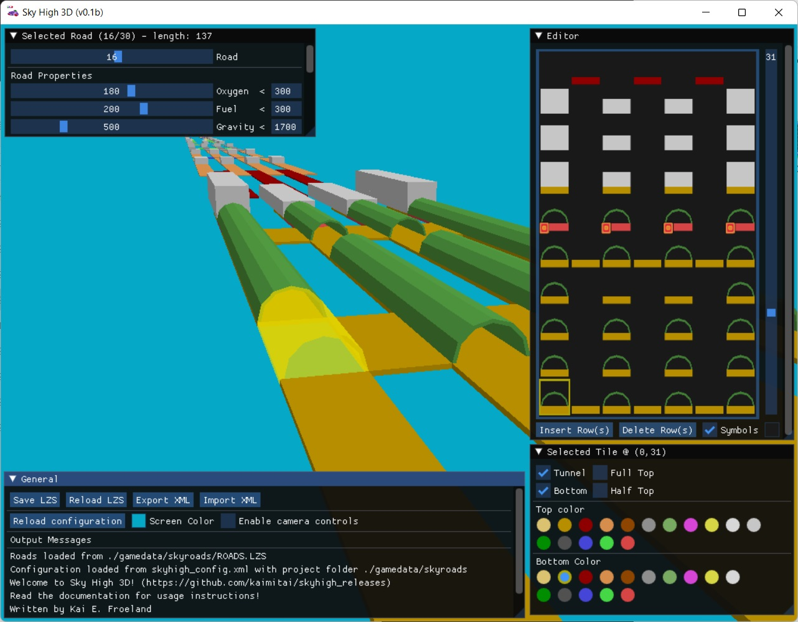
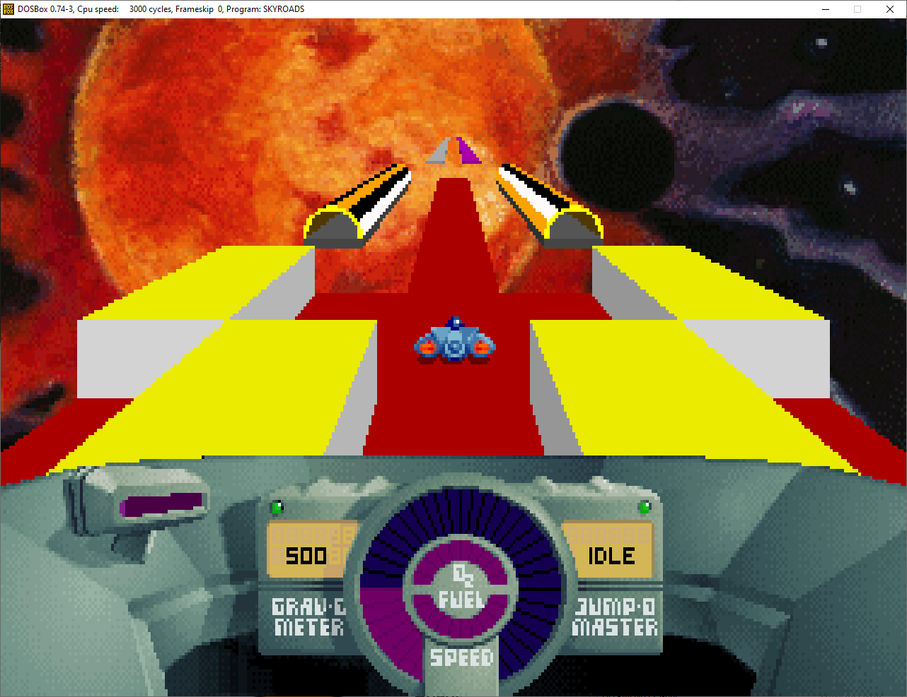
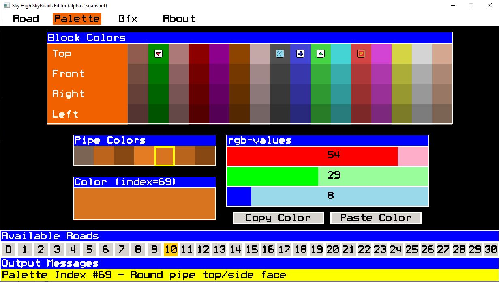
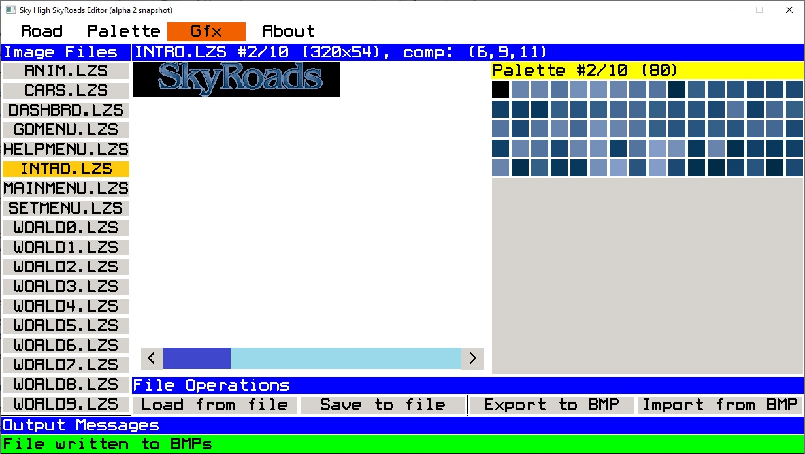
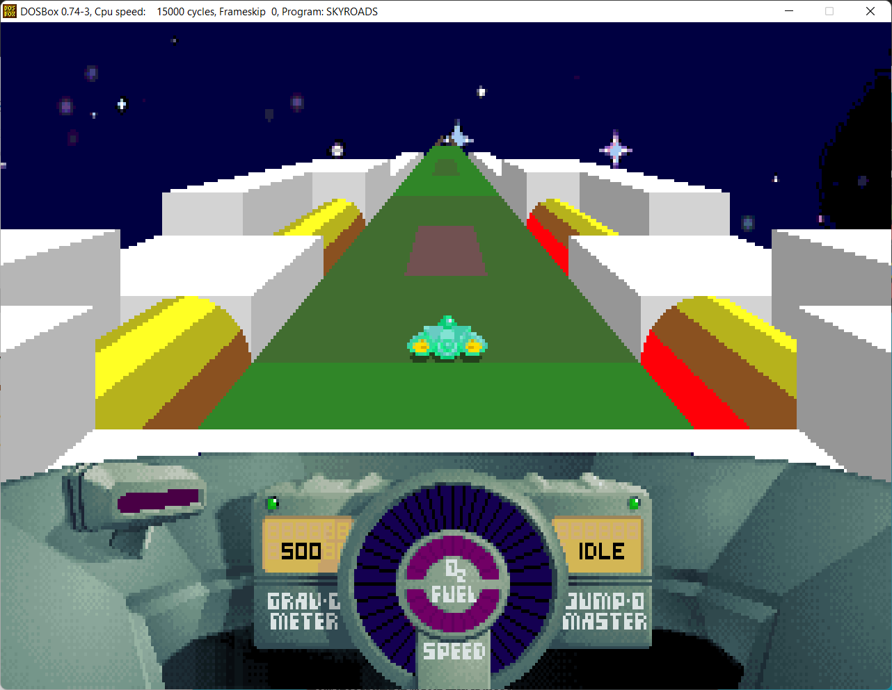

# Sky High SkyRoads Editor

Welcome to the Sky High release repository. Here we will post new releases of the software when they are available. The current version is 0.9.

### Editor Capabilities
The editor in its current state is fairly capable, but we aim to add more functionality with time. As of now, the following functions will be available:

#### Level Editing - Roads
The main part of the editor is of course editing of the levels themselves. This screen presents all the levels in a file in a graphical way, indicating which properties any tile has. It is possible to copy and paste tiles, rows, palettes and even whole levels. The editor is mostly mouse-driven, but supports keyboard shortcuts for the most common operations. More shortcuts will be added with time.

###### The editor will show all the level and tile information

###### Bring your own creativity and ideas into SkyRoads level design

#### Level Editing - Palette
Another part of the level editor is the palette editor. This screen will allow you to change the colors of the level on the fly, indicating which colors have special properties - as well as showing a text of what a certain palette index is used for in the game. The colors can be changed with rgb-sliders using the mouse, but can also be copied and pasted within a palette or between palettes.

###### The palette editor will show all the palette information for a given level

#### Graphics viewer, exporter and importer
In the Gfx screen, you will be able to load LZS-images from file, including those files containing multiple images. Here you can see each image, as well as its corresponding palette. All the images can be exported to BMPs - and there is also support for importing BMP(s) to an LZS-image. This will allow us to alter the world backgrounds, level select screen, space ship dashboard and so on.

###### The gfx editor showing image 2/10 in INTRO.LZS

###### The images can be changed in the editor and will be loaded in the game

