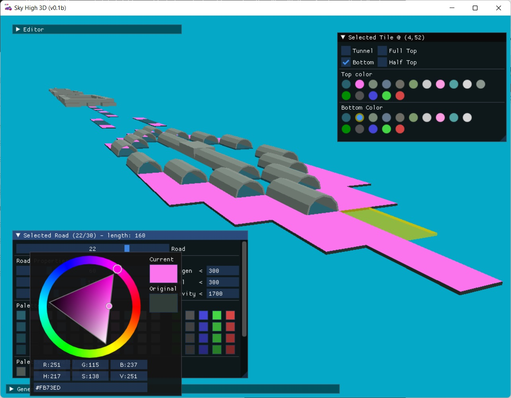

# Sky High SkyRoads Editor

Welcome to the Sky High release repository. Here we will post new releases of the software when they are available. The current version is 1.0. get the latest precompiled win-x64 distribution under the [repository releases](https://github.com/kaimitai/skyhigh_releases/releases/).

### Editor Capabilities
The editor in its current state is fairly capable, but we aim to add more functionality with time. As of now, the following functions will be available:

#### Level Editing - Roads
The main part of the editor package is of course editing of the levels themselves. The level editor presents all the levels in a file in a graphical way, indicating which properties any tile has. Every aspect of the level data can be modified, and the 3D-version of the editor will show a live 3D-view of the level. The editor is mostly mouse-driven, but supports keyboard shortcuts for the most common operations.

We also support saving the level files in an XML format, which allows users to more easily compare file versions, use version control systems to track file history, and collaborate on level pack projects.

###### The editor will show all the level and tile information

#### Level Editing - Palette
Every level in SkyRoads is associated with a palette. The palette colors can be changed using color pickers, and the 3D-view will be updated live.

###### The palette can be changed, and changes are visible on the fly

#### Graphics viewer, exporter and importer
In the Gfx screen in the Sky High editor, you will be able to load LZS-images from file, including those files containing multiple images. Here you can see each image, as well as its corresponding palette. All the images can be exported to BMPs - and there is also support for importing BMP(s) to an LZS-image. This will allow us to alter the world backgrounds, level select screen, space ship dashboard and so on. We also have an xml-format for graphics, for advanced modding.

###### The gfx editor showing image 2/10 in INTRO.LZS

###### The images can be changed in the editor and will be loaded in the game

#### Changelog

##### v1.0
* Rewrote the level editor portion of the application as a separate application, Sky High 3D - featuring a 3D live view of levels.
 * Added general configuration xml which lets you set working LZS-folder, and define rgb-values which define transparency for BMP import/export.
 * Reworked the roads xml-format. The levels will now be exported to individual xml files, rather than having all levels in one file.
 * Added graphics configuration xml - which will enforce rules for BMP import/export, as well as inject metadata into the resultant imagefile.
 * Added support for exporting and importing graphics as xml files. These xml files will be 100% accurate representations of their graphics LZS file counterparts, and will be interchangeable with LZS from the editor's point of view.

##### v0.99
* Removed dependencies on all but the core SDL2 library, by baking the font graphics into the executable.
* Rewrote the input handler. In particular mousewheel scrolling on the level grid has been fixed.
* Made keyboard shortcut for cutting tiles and rows in the tile grid. (Ctrl+X)
* Made keyboard shortcut for toggling bottom blocks in the tile grid. (B)
* Added support for reading the demo level packs with fewer than 31 levels.
* Added support for automatically determining the best compression parameters for any level.
* Added support for saving and loading level files as xml.
